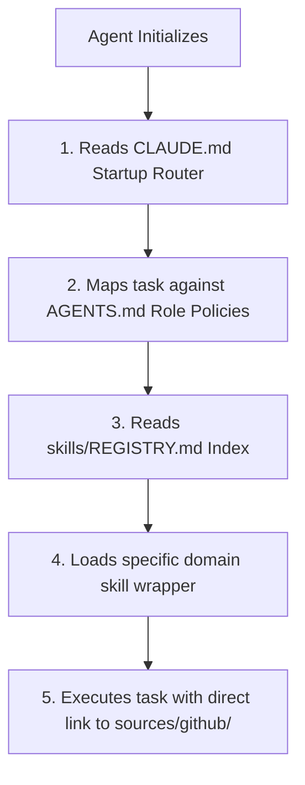

# 🧠 Reusable Agent Skills (`@ruvnet/agent-skills`)

[](https://opensource.org/licenses/MIT)
[](https://nodejs.org/)
[](#)

A modular, plug-and-play CLI tool and repository of engineering practices, framework instructions, and security guidelines optimized for agentic workflows (e.g., **Gemini API**, **Claude Code**, **Hermes**, **Cursor**, **OpenClaw**).

This system keeps agent contexts slim, fast, and token-efficient by separating deep guidelines from the active workspace. Agents load only the skills relevant to their specific task.

---

## ⚡ Quick Start & Installation

Run the CLI tool inside your workspace root to initialize the directory structure, copy templates, clone community repositories, and bootstrap the agent skill environment:

```bash
npx @ruvnet/agent-skills init
```

*This command automatically bootstraps your directory structure, copies default agent guides (`CLAUDE.md`, `AGENTS.md`), and clones all upstream developer repositories.*

---

## 🗺️ System Architecture (ADR-001)

The system implements a **two-tiered architecture** to keep your development environment clean and ensure easy upstream updates:

```
project-skill-setup/
├── CLAUDE.md                   # 🚦 Startup Router & entry point for all agents
├── AGENTS.md                   # 👤 Agent role-specific routing policies
├── README.md                   # 📄 You are here (project overview)
│
├── adr/                        # 🏛️ Architectural Decision Records
│   └── 001-skill-folder-structure.md
│
├── memory/                     # 💾 Handoff & session state persistence
│
├── reports/                    # 📊 System setup verification & analysis
│   ├── md/                     # Source Markdown reports
│   └── html/                   # Compiled interactive HTML reports
│
├── skills/                     # ⚡ Domain category wrappers (Lightweight)
│   ├── REGISTRY.md             # 📇 Master Registry Index of all skills
│   ├── ai-agents/              # Agent framework skills (RAG, Swarm, Memory)
│   ├── backend/                # Database and API instructions
│   ├── devops/                 # Deployment, K8s, and Cloud Run recipes
│   ├── frontend/               # UI, styling, and GSAP animations
│   ├── security/               # Cybersec, threat modeling, OWASP guides
│   ├── shared/                 # Coding principles, diagnostics, debugging
│   └── workflow/               # Development lifecycle checklists
│
└── sources/
    └── github/                 # 🌐 Cloned upstream community skill repositories
```

---

## 🚀 How It Works (The Routing Protocol)

When an agent initializes in this workspace, it executes the following protocol:



1. **Startup**: The agent reads `CLAUDE.md` first to set baseline principles (Karpathy Coding Principles).
2. **Role Mapping**: The agent maps its role against `AGENTS.md` to load checklists (e.g., Coder nabs TDD, Security Agent nabs Cybersec Index).
3. **Skill Discovery**: The agent references `skills/REGISTRY.md` to discover task-specific skills.
4. **Execution**: The agent loads a lightweight category wrapper (e.g., `skills/frontend/gsap-core.md`), which points to deep documentation under `sources/github/`.

---

## 📇 Registered Skills Catalog

The repository includes **45+ categorized wrappers** mapping to specialized upstream guidelines:

<details>
<summary>📂 View Complete Skill Directory</summary>

### 🔹 Shared (Cross-Domain)
* **Karpathy Coding Principles**: Baseline discipline (Simplicity, Surgical edits, Goal-driven loops).
* **Superpowers Debugging**: Defense-in-depth debugging.
* **Structured Diagnostics & Architecture**: Templates for diagnosing bugs and refactoring code.

### 🔹 Frontend
* **GSAP Core & Timelines**: Sequencing, scroll triggers, plugins, and performance tuning.
* **Framework Integrations**: GSAP integrations for React, Vue, and Svelte.

### 🔹 Backend
* **Database hardeners**: Google Firebase, Cloud SQL (PostgreSQL, MySQL), and AlloyDB.

### 🔹 DevOps
* **Google Cloud**: Deployment recipes for Cloud Run, GKE, BigQuery, and Well-Architected Framework guidelines.

### 🔹 Security
* **Cybersecurity Index**: A gateway mapping **754 cybersecurity skills**.
* **Hardening Modules**: Threat modeling, web application security (OWASP), cloud hardening, incident response, and secrets management.

### 🔹 AI Agents
* **Gemini API**: Integration and development guidelines.
* **Memory & RAG Pipelines**: CocoIndex (RAG), Graphiti (Temporal Graphs), Ruflo (Swarm Orchestration), and Mem0 (Memory layer).

### 🔹 Workflow
* **Product Lifecycles**: Requirements gathering, implementation plans, code review, TDD, context handoffs, and PRD/Issue/Triage automation.

</details>

---

## 📊 Interactive HTML Reports

The project contains a built-in markdown-to-HTML compilation script to create clean, interactive reports using Tailwind CSS for human review:

1. Create a markdown report inside `reports/md/` (e.g. `reports/md/audit.md`).
2. Run the compiler script:
   ```bash
   node scripts/md_to_html.js reports/md/audit.md
   ```
3. The script compiles the document and outputs a styled, responsive report in `reports/html/audit.html`.

---

## 📝 How to Add New Skills

1. Place the cloned community repo under `sources/github/` (or write custom guides under `sources/notes/`).
2. Add a concise `.md` wrapper under `skills/<domain>/`.
3. Add the skill entry into [skills/REGISTRY.md](file:///c:/.USER%20FOLDER/Projects/Project-skill-setup/skills/REGISTRY.md) detailing its **Path**, **Source**, **Use-cases**, and **Load Priority**.
4. Update `CLAUDE.md` if the skill should be loaded globally.

---

## ⚖️ License

Distributed under the **MIT License**. See `LICENSE` for details.
